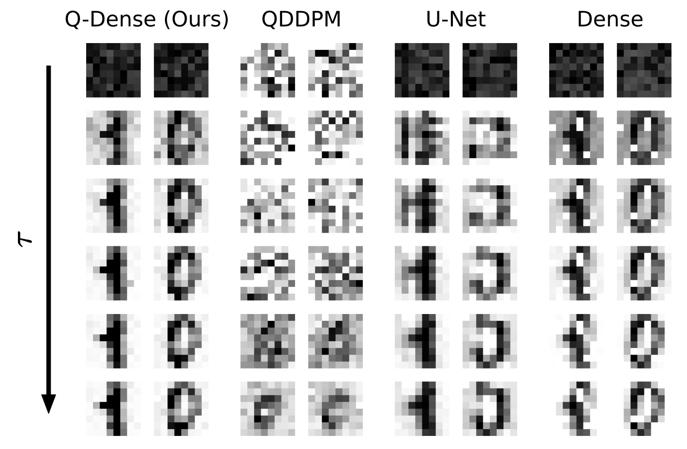

# Quantum Denoising Diffusion Models

Install the requirements: `pip install -r requirements.txt` (preferably in a virtual environment).

- Run `python main.py --help` to see all the options.
- Run `python main.py` to train and evaluate a `Q-Dense` model on the MNIST 8x8 dataset.
